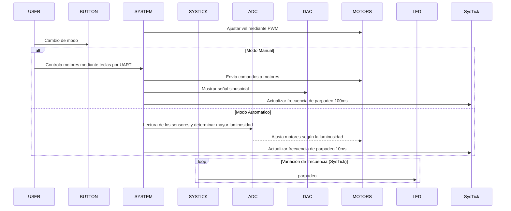

# GIRASOL ELECTROMECÁNICO
 **Trabajo Final de Electronica digital III - Grupo ARMageddon**

El proyecto consiste en el desarrollo de un prototipo con dos grados de libertad diseñado para posicionarse automáticamente en función de la mayor captación de luz, utilizando cuatro sensores LDR ubicados en su extremo. Además, el prototipo puede ser controlado manualmente desde una computadora mediante las teclas W, S, A, y D, permitiendo movimientos precisos en ambas direcciones. El cambio entre los modos automático y manual se realiza a través de un botón físico, y el estado del sistema se indica visualmente mediante un LED y mediante una señal analógica transmitida por el DAC, brindando información en tiempo real sobre el modo de operación.

### Objetivos principales
1. **Autonomía en el seguimiento de la luz**: Implementar un sistema capaz de detectar y orientarse hacia la fuente de luz con mayor intensidad utilizando los sensores LDR.
2. **Control manual confiable**: Habilitar el manejo del prototipo mediante una interfaz de teclado para movimientos precisos en ambas direcciones.
3. **Interfaz de cambio de modos**: Integrar un botón físico que permita alternar sin interrupciones entre los modos de operación manual y automático.
4. **Indicadores de estado**: Incorporar un LED y una señal analógica para representar visualmente y de manera remota el modo de funcionamiento.

### Criterios de éxito
El prototipo debe ser capaz de orientarse de manera precisa hacia la fuente de luz más intensa en modo automático.
La respuesta a los comandos de teclado debe ser inmediata y precisa en modo manual.
El cambio entre los modos manual y automático debe ser fluido y claramente indicado por el LED y el DAC.
El sistema debe operar de manera confiable y estable durante períodos prolongados, sin fallas en los sensores o los controles.

---

## Diseño del proyecto

#### RGB & Systick
Un LED de color de tipo RGB es básicamente la unión de 3 LEDs de diferentes colores: rojo, verde y azul. El control de los colores y frecuencia de parpadeo se realiza mediante el Systick que indica el modo en el que esta trabajando el sistema. 

 El SysTick Timer es un contador descendente de 24-bits que produce una interrupción al llegar al valor 0. La intención es proveer intervalos de tiempo fijos de 10 ms entre interrupciones para modo manual y 100ms para modo automatico.

#### Interrupción Externa
Las interrupciones externas son señales generadas por eventos externos que interrumpen el flujo normal del programa para ejecutar una tarea específica.

En este proyecto, un botón conectado a un pin configurado como entrada genera una interrupción externa, permitiendo sto permite alternar entre el modo manual y automático del sistema sin demoras perceptibles.
El proceso es el siguiente:

El botón genera una interrupción al ser presionado.
El handler de la interrupción invierte el estado del sistema.
La interrupción se desactiva temporalmente para evitar rebotes (debouncing) y luego se reactiva.

#### El convertidor de analógico a digital (ADC)
La conversión de analógico a digital (ADC) es la técnica que permite transformar una señal analógica (continua en tiempo y amplitud) en una secuencia numérica que puede ser utilizada por el procesador central del microcontrolador. El propósito de la experiencia es mostrar cómo se lleva a cabo la conversión y cómo usarla para transformar una señal de voltaje en un número. A continuación, el número obtenido se analizara para en base a lo medido realizar una acción.

Un ADC tiene muchas características, pero las más importantes son, sin duda: el número de bits que expresan el resultado de la conversión y la velocidad máxima de conversión. Estos dos parámetros son, en el caso del microcontrolador LPC1769, iguales a 12 bits y 200 kHz; El primer parámetro nos dice qué tan precisa es nuestra conversión (resolución), mientras que el segundo parámetro (frecuencia de muestreo) nos dice cuántas muestras de la señal se convierten en un segundo. Tenemos 8 canales de adquisición disponibles para nuestro ADC, pero en la experiencia de solo usaremos 4.

#### Direct Memory Access (DMA)
El módulo DMA permite transferir datos entre los periféricos y la memoria del microcontrolador sin involucrar directamente al procesador central. Esto libera recursos del CPU para realizar otras tareas, optimizando el rendimiento del sistema.

En este proyecto, el DMA se utiliza para transmitir datos al DAC. El sistema genera una señal que representa el estado del modo de operación (manual o automático) y la transmite periódicamente sin interrupciones significativas en la ejecución principal.

#### convertidor digital a analógico (DAC)
El DAC convierte valores digitales provenientes del procesador (o del DMA) en señales analógicas. En el LPC1769, el DAC tiene una resolución de 10 bits y puede generar una señal analógica de hasta 3.3V.

En este proyecto, el DAC se utiliza para enviar una señal sinusoidal que representa el estado del sistema en automatico.

#### El periférico PWM (modulador de ancho de pulso)
El PWM puede realizar ondas cuadradas con ciclo de trabajo (relación entre la parte alta de la señal y el período de repetición) ajustable de 0% a 100%. En nuestro caso modulara la velocidad a la cual giran los motores de CC.

#### Comunicación Serial (UART)
El módulo UART es responsable de establecer la comunicación entre el microcontrolador y la computadora. En este proyecto, se utiliza para recibir los comandos de control manual a través del teclado (teclas W, S, A, D).

La UART funciona con un módulo USB-UART que conecta el microcontrolador a la computadora, permitiendo un intercambio confiable de datos.

### Materiales
- Microcontrolador CORTEX-M3 LPC1769 rev D
- Cable USB para conexión a PC
- IDE: MCUXpresso
- Estructura en 3D con 16 tornillos de 12mm y 4 de 30mm con sus respectivas arandelas y tuercas + 3 rulemanes chicos.
- Driver L298N
- 2 Motores de CC de 6gr
- 1 Modulo USB UART
- 4 resistencias 470 Ω
- Fuente de 12V
- 3 Protoboard
- Cables de conexión para placa de pruebas
- 4 LDR
- 1 boton
- 1 osciloscopio para observar la salida del DAC
- 5 Conversores de 3.3V a 5V

---

## Instalación y configuración

### MCUXpresso IDE
    Una IDE o entorno de desarrollo integrado es un sistema de software para el diseño de aplicaciones que combina herramientas del desarrollador comunes en una sola interfaz gráfica de usuario. Generalmente un IDE cuenta con las siguientes características:

- **Editor de código fuente:** Editor de texto que ayuda a escribir el código con funciones como el resaltado de la sintaxis con indicaciones visuales, el relleno automático específico para el lenguaje y la comprobación de errores a medida que se escribe el código.

- **Automatización de las compilaciones locales:** Herramientas que automatizan las tareas sencillas y repetitivas como la compilación del código fuente en un archivo binario.

- **Depurador:** Software para probar los programas y mostrar la ejecución paso a paso para facilitar el debug.

### Instalación
    Para la instalación de esta IDE será necesario descargar el instalador de la página oficial de NXP. Para esto dirigirse al siguiente link, registrarse e ingresar a la sección de descargas.

[MCUXpresso IDE for NXP MCUs | Linux, Windows and MacOS | NXP Semiconductors | NXP Semiconductors](https://www.nxp.com/design/software/development-software/mcuxpresso-software-and-tools-/mcuxpresso-integrated-development-environment-ide:MCUXpresso-IDE)

    Se deberán aceptar los terminos y condiciones y luego nos llevará a una ventana con todos los instaladores disponibles. Descargar el adecuado para su sistema operativo (Linux, macOS, Windows). En caso de tener Windows como sistema operativo, el instalador que se descarga es un .exe que simplemente hay que ejecutar y seguir las instrucciones de instalación.
   
    Al ejecutar la aplicación, lo primero que nos aparecerá será la elección de un workspace, este espacio de trabajo es el directorio principal en el que se almacenarán y organizarán los proyector y archivos relacionados con el desarrollo. Es el área en la que se trabaja con los proyectos y la IDE guarda los archivos de configuración y datos asociados. 

    El concepto de espacio de trabajo es útil porque te permite mantener tus proyectos organizados y separados. Puedes trabajar en múltiples proyectos en paralelo y cambiar fácilmente entre ellos dentro de la IDE. Además, el espacio de trabajo almacena las preferencias y configuraciones de la IDE, como el esquema de color, atajos de teclado y configuraciones del depurador, entre otras cosas.

    Esta ruta puede dejarse por defecto o se puede colocar otra.

    Al dar click en lanzar, se nos abrirá la ventana principal de la IDE. Para compilar este proyecto se debe generar un nuevo proyecto desde `file>new>create a new C/C++ project`. En el SDK wizard, se debe seleccionar la placa LPC 1769. Luego, elegir la opción `C project`, Elegir el nombre y ubicación del proyecto. Posteriormente se nos solicita que importemos las librerías a usar. Para esto, hacer click en `import`, dar click en `Project archive (zip) > Browse` y allí seleccionar el .zip que se descarga del drive ([CMSISv2p00_LPC17xx.zip](https://drive.google.com/drive/folders/10A9xhIxx6ag75GtEwLzxr8pCdP6hR1HC )). Una vez importada, seleccionarla como librería del proyecto. Esta librería proporciona una capa de abstracción de software que facilita el desarrolllo de software embebido para microcontroladores basados en la arquitectura ARM Cortex-M. Ademas seleccionar la libreria CMSISV2p00 antes de `continuar` y en las librerías de DSP no es necesario seleccionar nada, simplemente dar a siguiente.

    Por último, nos da la opción de elegir la estructura de directorios del proyecto. Dandonos la posibilidad de cambiar el nombre del directorio para los fuentes y la posibilidad de crear un directorio 'inc' para los headers file y añadir automáticamente al path este mismo. Dar en `Finish` y se abrirá la ventana de un proyecto con un main básico, alli copiar el codigo de la carpeta `src` de este repositorio y compilar.

---

